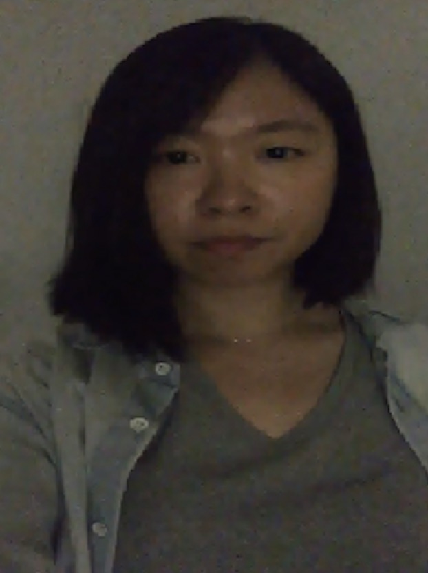
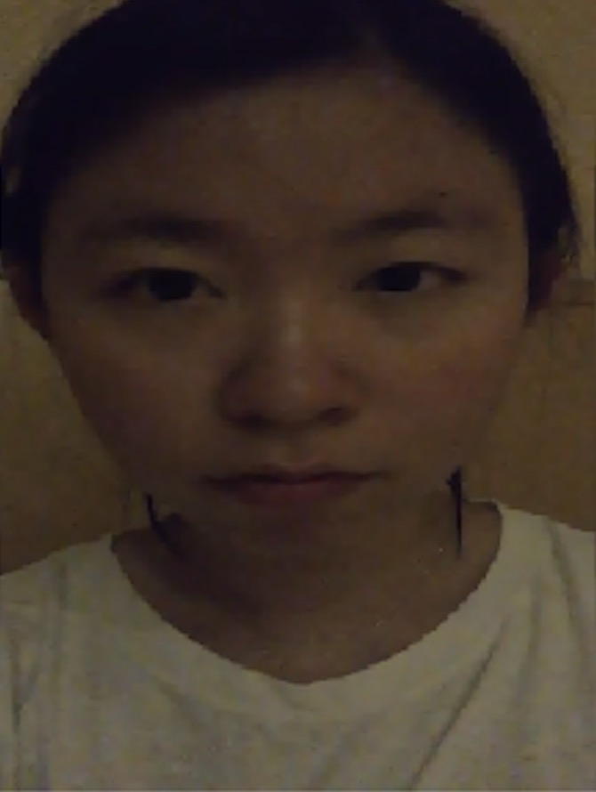
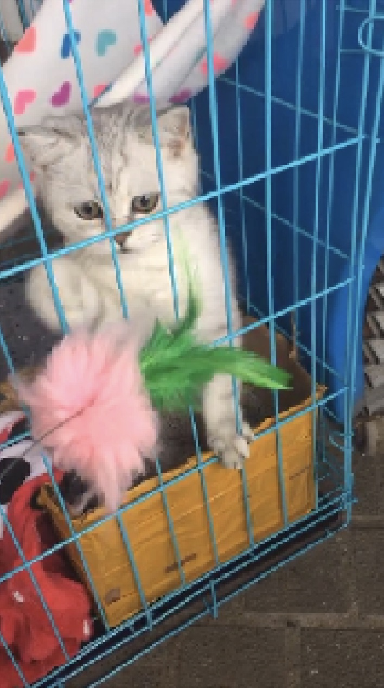

# Adaptive-autoencoder-dictionary-learning
I took Responsibility to solve real-time video denoising and compression problems, especially in the insufficient light scenario. When light is insuffient, the image or video quality can suffer from increased noise. To conquer the problem, we used a data-driven dictionary learning method to get an adaptive autoencoder. The autoencoder can be used like DCT (discrete consine transform) to denoising or compression tasks. 

* The formulation of the problem can be described as follows:

      
     This not only requires the least square fidelity part to be as accurate as possible, and it also requires the coefficients of the representation under the   dictionary basis to be sparse. One can use an alternating optimization method to solve the above problems.

* I also investigate a function for noise level dectection. This could help for selection of hyperparameters adaptively based on the image/ video source itself.
* All the experimental data are sampled from real iphone video sources, so the noise in each image/video source are real and don't necessarily obey any distribution assumptions. 
* Some reports saying that the human eye can see between 30 and 60 frames per second. Video streaming usually utilize 24-30 frames per second standard. Therefore, the computation time for each frame image in processing shoule be less than 1/pfs. Moreover, as the video calling function use the computation of the phone itself, light computational cost solution is in need.
* Based on some optimization and improvement techniques, the processing time for Win8 - Intel i5-4570 3.20GHz - 8GB RAM pc is less than 1/250s.
* Demos are as follows.

Original                   |Processed
:-------------------------:|:-------------------------:
            |  

Original                   |Processed
:-------------------------:|:-------------------------:
            |  

* Details preserved demo

Original                   |Processed
:-------------------------:|:-------------------------:
            |  
